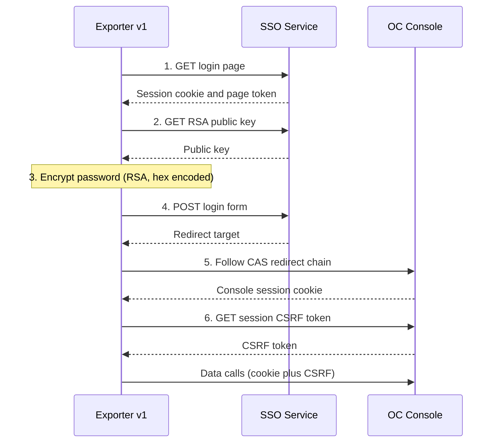
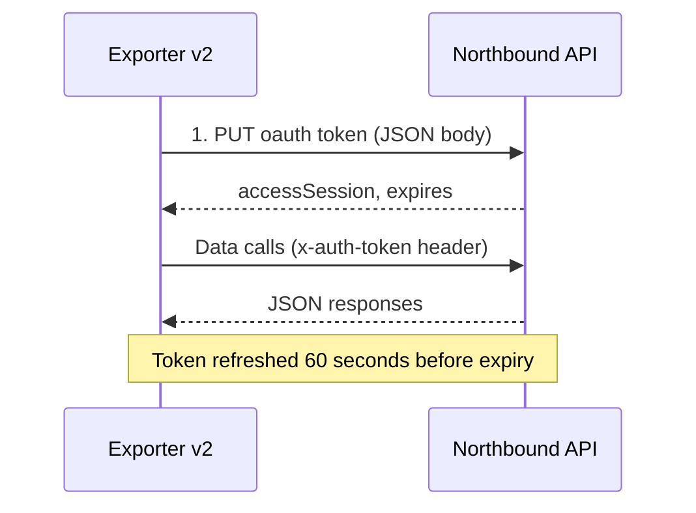

# HCS OC Exporter v2: Token-Based Northbound Authentication Migration

A documented migration of a Prometheus exporter for Huawei Cloud Stack (HCS) ManageOne Operation Center (OC) from a six-step browser-style SSO login to a single OAuth token exchange against the standard northbound API, delivered in collaboration with the vendor and validated in a development environment.

This project is the follow-up to [hcs-exporter-auth-incident-report](https://github.com/JThomas404/hcs-exporter-auth-incident-report), which documents the SSO lockout incident that motivated the change.

---

## Table of Contents

1. [Overview](#overview)
2. [Real-World Business Value](#real-world-business-value)
3. [Skills Demonstrated](#skills-demonstrated)
4. [Project Folder Structure](#project-folder-structure)
5. [Tasks and Implementation Steps](#tasks-and-implementation-steps)
6. [Core Implementation Breakdown](#core-implementation-breakdown)
7. [IAM Role and Permissions](#iam-role-and-permissions)
8. [Project Features (Detailed Breakdown)](#project-features-detailed-breakdown)
9. [Design Decisions and Highlights](#design-decisions-and-highlights)
10. [Local Testing and Validation](#local-testing-and-validation)
11. [Errors Encountered and Resolved](#errors-encountered-and-resolved)
12. [Conclusion](#conclusion)

---

## Overview

### What was built

The OC exporter is a Python service that collects PostgreSQL RDS and infrastructure data from ManageOne OC and exposes it in Prometheus format for Grafana dashboards and alerting. Version 1 authenticated by automating the browser login: it fetched a login page, extracted a session cookie, encrypted the password with an RSA public key, submitted a form, followed a chain of CAS redirects and finally fetched an OC CSRF token. Each step depended on the previous one, and repeated failures could trigger an account lockout, as described in the [incident report](https://github.com/JThomas404/hcs-exporter-auth-incident-report).

Version 2 replaces that sequence with one request. Working with the vendor, the exporter now calls the documented northbound token endpoint, receives an access session and sends it in a single header on every later call. The same migration moved CMDB discovery, performance metrics and audit collection onto documented northbound endpoints.

### Scope boundaries

Included:

- The authentication redesign, from six steps to one.
- A grouped summary of the other API changes made in v2 (CMDB discovery, performance metrics, audit endpoint).
- Evidence gathered in a development environment with a dedicated integrated account.

Intentionally excluded:

- Production deployment and production-scale measurements. All results in this document come from a development environment.
- The audit collector logic (event classification, Grafana annotations and alerting rules). Only the audit API connectivity is covered.
- The AK/SK-signed HCS RDS calls for backups and disk auto-expansion, which are unchanged.
- Employer, client and vendor-internal details. Hostnames, ports, accounts and identifiers are shown as placeholders such as `<oc-host>` and `<oc-username>`.

### Components

| Component                   | Location                                                                                             |
| --------------------------- | ---------------------------------------------------------------------------------------------------- |
| Documentation (this file)   | [README.md](https://github.com/JThomas404/hcs-oc-exporter-token-auth-migration/blob/main/README.md)  |
| Exporter source             | Held in a private repository and not published                                                       |
| Predecessor incident report | [hcs-exporter-auth-incident-report](https://github.com/JThomas404/hcs-exporter-auth-incident-report) |

---

## Real-World Business Value

| Outcome                                 | Detail                                                                                                                                                                 |
| --------------------------------------- | ---------------------------------------------------------------------------------------------------------------------------------------------------------------------- |
| Simpler, supported authentication       | Six dependent steps became one documented API call, removing the cookie, CSRF and redirect handling that failed in unpredictable ways.                                 |
| Smaller integration surface             | Of 21 calls inventoried in v1, 8 were removed, 11 were moved to documented northbound endpoints and 2 were left unchanged.                                             |
| Fewer failure modes at login            | The RSA key fetch, hex-encoded form login and CAS redirect chain no longer exist in the exporter.                                                                      |
| Resilience retained                     | Exponential backoff and authentication health metrics were kept, because the lockout behaviour of the new endpoint under repeated failures has not been characterised. |
| Vendor-supported contract               | Calls now follow the vendor northbound API reference, reducing exposure to UI changes across product upgrades.                                                         |
| Observability of the integration itself | Authentication success, failure, consecutive failure and backoff state are exported as Prometheus metrics.                                                             |

No cost or time savings are claimed. The measurable changes are the step count (6 to 1) and the call inventory (21 calls reduced to 13 distinct call sites after removals).

---

## Skills Demonstrated

- **API migration analysis:** inventorying every outbound call, mapping each to its replacement and classifying it as removed, moved or unchanged.
- **Authentication engineering:** replacing a multi-step SSO flow with a token lifecycle (acquire, attach, refresh, recover) in Python standard library code.
- **Failure handling:** exponential backoff (60, 120, 300 and 600 seconds), a critical log after every 100 consecutive failures and automatic re-authentication after a 401.
- **Observability:** Prometheus counters and gauges for authentication health in addition to the infrastructure metrics.
- **Vendor collaboration:** reading northbound API reference sections, validating them against a live system and recording where the documented behaviour differed from observed behaviour.
- **Evidence-led validation:** separating protocol-level success (HTTP 200) from functional success (data returned), and reporting partial results honestly.
- **Secure engineering practice:** credential-safe test tooling (no-echo password prompt, no token or body printing), placeholder redaction and explicit documentation of known risks.
- **Platform knowledge:** Huawei Cloud Stack ManageOne OC, CMDB resource types, performance management object types and indicators, and audit traces.
- **Technical writing:** Mermaid diagrams, structured trade-off analysis and a reproducible validation procedure.

---

## Project Folder Structure

This repository contains documentation only. The exporter source remains in a private repository, so the structure below shows the published content followed by the logical layout of the private source for reference.

```text
hcs-oc-exporter-token-auth-migration/
└── README.md        Architecture, migration summary, redacted code excerpts and validation evidence
```

Logical layout of the private exporter module (not published):

| Section                | Responsibility                                                                                   |
| ---------------------- | ------------------------------------------------------------------------------------------------ |
| Configuration          | Environment variables for host, account, scrape interval, tenant filtering and audit opt-in      |
| `OCSession`            | Token exchange, expiry tracking, backoff, authenticated GET and POST helpers                     |
| Instance discovery     | Paged CMDB queries for RDS nodes, parent instances, hosts, storage pools, subnets, ports and VMs |
| Performance collection | Object type lookup, indicator ID lookup and latest-data queries                                  |
| Audit retrieval        | Paged query of the northbound audit traces endpoint, disabled by default                         |
| Prometheus metrics     | Metric definitions, including the `oc_auth_*` family                                             |
| Main loop              | Scrape cycle, HTTP exposition on the exporter port and service lifecycle                         |

---

## Tasks and Implementation Steps

1. **Document the failure mode.** The SSO lockout incident was written up first so that the redesign had a clear problem statement. Artefact: [hcs-exporter-auth-incident-report](https://github.com/JThomas404/hcs-exporter-auth-incident-report).
2. **Inventory every outbound call.** All 21 calls made by v1 were listed with method, host, authentication method, purpose and calling function. This made the scope of the change visible before any code was altered.
3. **Agree replacements with the vendor.** For each call, the vendor supplied the equivalent northbound endpoint where one existed, and confirmed that audit access was the last item still being worked on.
4. **Prove the token exchange in isolation.** A credential-safe probe script tested the token endpoint and one follow-up CMDB read, printing only status codes, header names and JSON key names.
5. **Replace the session class.** `OCSession` was rewritten around a single `PUT` request, with expiry tracking, a 60-second refresh margin and the existing backoff behaviour.
6. **Migrate CMDB discovery.** Discovery functions were pointed at the tenant-resource and CMDB instance endpoints, and the response parser was extended to read the `objList` layout.
7. **Migrate performance collection.** The metric catalogue call was removed. Collection now resolves an object type ID and indicator IDs, then queries the latest-data endpoint.
8. **Migrate the audit endpoint.** The console-realm audit call was replaced by the northbound traces endpoint, kept behind an opt-in flag.
9. **Validate in the development environment.** Each discovery type, the performance query and the audit endpoint were exercised with a dedicated integrated account, and results were recorded as counts and status codes without identifiers.
10. **Resolve authorisation gaps.** The audit endpoint initially returned HTTP 401. Adding the integrated account to the audit administrator group resolved it, and the endpoint now returns HTTP 200.

---

## Core Implementation Breakdown

### Before and after

Version 1 required six dependent steps before the first useful API call:



Version 2 needs one request:



### Token exchange

The exporter sends the account name and password as JSON and validates the response. A missing `accessSession` is treated as a failure, and an invalid `expires` value falls back to 3600 seconds.

```python
# Build the JSON body for the northbound token request
payload = json.dumps({
    "grantType": "password",
    "userName": self.username,   # <oc-username>
    "value": self.password,      # <oc-password> injected from the environment
}).encode("utf-8")

# Target the documented token endpoint on the northbound host
req = Request(
    "{}/rest/plat/smapp/v1/oauth/token".format(self.oc_host.rstrip("/")),  # <oc-host>
    data=payload,
    method="PUT",
)
req.add_header("Content-Type", "application/json;charset=utf-8")
req.add_header("Accept", "application/json;charset=utf-8")

# Send the request and parse the JSON response
with self.opener.open(req, timeout=HTTP_TIMEOUT) as resp:
    data = json.loads(resp.read().decode("utf-8"))

# Reject responses that do not contain a usable access session
access_session = data.get("accessSession")
if not isinstance(access_session, str) or not access_session:
    raise RuntimeError("OAuth token response missing accessSession")

# Fall back to a one-hour lifetime if the expiry value is not valid
expires = data.get("expires")
if not isinstance(expires, (int, float)) or expires <= 0:
    expires = 3600

# Record the session and its expiry time
self.access_session = access_session
self.token_expires_at = time.time() + expires
self.authenticated = True
```

### Attaching the token and recovering from 401

Every northbound call carries one header. A 401 marks the session as unauthenticated so that the next call re-authenticates.

```python
def _add_auth(self, req):
    # Refuse to send a request without a valid session
    if not self.authenticated or not self.access_session:
        raise RuntimeError("OC session is not authenticated")
    # Authenticate the request with the access session
    req.add_header("x-auth-token", self.access_session)

# Inside the shared request helper
except HTTPError as e:
    # Mark the session invalid on 401 so the next call re-authenticates
    if e.code == 401:
        self.authenticated = False
```

### Refresh and backoff

```python
def ensure_authenticated(self):
    # Reuse the token until 60 seconds before it expires
    if self.authenticated and time.time() < self.token_expires_at - 60:
        return

    # Respect the backoff window after a failed attempt
    if self.next_auth_attempt and time.time() < self.next_auth_attempt:
        return

    # Otherwise request a new token
    self.login()

def _calc_backoff(self):
    # Step through 60, 120, 300 and then 600 seconds
    backoffs = [60, 120, 300, 600]
    idx = min(self.consecutive_auth_failures - 1, len(backoffs) - 1)
    return backoffs[max(idx, 0)]
```

On failure the exporter increments `oc_auth_failures_total`, sets `oc_auth_consecutive_failures` and `oc_auth_backoff_seconds`, and logs a critical message after every 100th consecutive failure. On success it resets the counters and sets `oc_auth_last_success_timestamp`.

### Migration summary

The v1 inventory contained 21 calls. The grouped result is shown below.

| Category                            | v1 calls | Outcome in v2                                                                                                                           |
| ----------------------------------- | -------- | --------------------------------------------------------------------------------------------------------------------------------------- |
| Authentication and session          | 8        | 7 removed (SSO, redirect, CSRF and token validation calls). 1 retained as the single token request.                                     |
| CMDB discovery                      | 8        | All moved from console resource routes to the tenant-resource and CMDB instance endpoints.                                              |
| Performance metrics                 | 2        | The metric catalogue call was removed. The data call was replaced by object type and indicator lookups followed by a latest-data query. |
| Audit                               | 1        | Moved from the console realm audit route to the northbound traces endpoint.                                                             |
| RDS backups and autoscaling (AK/SK) | 2        | Unchanged.                                                                                                                              |
| **Total**                           | **21**   | **8 removed, 11 moved, 2 unchanged**                                                                                                    |

Representative examples:

| Purpose            | v1                                                         | v2                                                       |
| ------------------ | ---------------------------------------------------------- | -------------------------------------------------------- |
| Authenticate       | Six-step SSO sequence                                      | `PUT /rest/plat/smapp/v1/oauth/token`                    |
| Discover RDS nodes | `/rest/ies/csmresmgrwebsite/v2/resources/cloud_rdspg_node` | `/rest/tenant-resource/v1/instances/CLOUD_RDS_NODE`      |
| Discover hosts     | `/rest/ies/csmresmgrwebsite/v2/resources/cloud_host`       | `/rest/cmdb/v1/instances/SYS_PhysicalHost`               |
| Read metrics       | `/rest/monitor-web/v1/monitor-view/metric-data`            | `/rest/performance/v1/data-svc/latest-data/action/query` |
| Read audit traces  | Console realm `.../vdcs/{vdc_id}/traces`                   | `/rest/octrace/v3.0/traces`                              |

<details>
<summary>Full mapping of all 21 calls (hosts and ports redacted)</summary>

| No. | Category           | v1 endpoint                                                    | v2 outcome                                                       |
| --- | ------------------ | -------------------------------------------------------------- | ---------------------------------------------------------------- |
| 1   | SSO authentication | `/mounisso/v1/pubkey`                                          | Removed                                                          |
| 2   | SSO authentication | `/mounisso/login.action/authenticate`                          | Removed                                                          |
| 3   | SSO authentication | `/mounisso/v1/login`                                           | Removed                                                          |
| 4   | SSO authentication | CAS redirect target                                            | Removed                                                          |
| 5   | OC session         | `/unisess/v1/auth/session` (cookie)                            | Removed                                                          |
| 6   | OC session         | `/unisess/v1/auth/session` (bearer)                            | Removed                                                          |
| 7   | Integrated auth    | `/rest/plat/smapp/v1/oauth/token`                              | Retained as the single auth call                                 |
| 8   | Integrated auth    | Console resource read used to validate the token               | Removed                                                          |
| 9   | CMDB discovery     | `.../resources/cloud_rdspg_node`                               | Moved to `/rest/tenant-resource/v1/instances/CLOUD_RDS_NODE`     |
| 10  | CMDB discovery     | `.../resources/cloud_rdspg_instance` (parent capacity)         | Moved to `/rest/tenant-resource/v1/instances/CLOUD_RDS_INSTANCE` |
| 11  | CMDB discovery     | `.../resources/cloud_rdspg_instance` (exporter targets)        | Moved to `/rest/tenant-resource/v1/instances/CLOUD_RDS_INSTANCE` |
| 12  | CMDB discovery     | `.../resources/cloud_host`                                     | Moved to `/rest/cmdb/v1/instances/SYS_PhysicalHost`              |
| 13  | CMDB discovery     | `.../resources/cloud_storage_pool`                             | Moved to `/rest/cmdb/v1/instances/CLOUD_STORAGE_POOL`            |
| 14  | CMDB discovery     | `.../resources/cloud_subnet`                                   | Moved to `/rest/tenant-resource/v1/instances/CLOUD_SUBNET`       |
| 15  | CMDB discovery     | `.../resources/cloud_port`                                     | Moved to `/rest/tenant-resource/v1/instances/CLOUD_PORT`         |
| 16  | CMDB discovery     | `.../resources/cloud_vm`                                       | Moved to `/rest/tenant-resource/v1/instances/CLOUD_VM`           |
| 17  | Monitor metrics    | `/rest/monitor-web/v1/monitor-view/metrics` (catalogue)        | Removed                                                          |
| 18  | Monitor metrics    | `/rest/monitor-web/v1/monitor-view/metric-data`                | Moved to the latest-data query                                   |
| 19  | HCS RDS (AK/SK)    | `/v3/{project_id}/instances/{instance_id}/disk-auto-expansion` | Unchanged                                                        |
| 20  | HCS RDS (AK/SK)    | `/v3/{project_id}/backups`                                     | Unchanged                                                        |
| 21  | Audit              | Console realm `.../vdcs/{vdc_id}/traces`                       | Moved to `/rest/octrace/v3.0/traces`                             |

Row 13 initially targeted a statistics dataset endpoint, which returned HTTP 404 on the tested build. The CMDB instance endpoint was used instead.

</details>

---

## IAM Role and Permissions

### Account model

The exporter uses a dedicated integrated account, separate from any human operator account. It authenticates to the northbound API only. The AK/SK credentials used for the HCS RDS calls are a separate mechanism and are not affected by this change.

### Permissions required

| Capability                           | Why it is required                                                   |
| ------------------------------------ | -------------------------------------------------------------------- |
| Northbound API access                | Allows the account to obtain a token and call documented endpoints.  |
| CMDB and tenant-resource read        | Required for RDS, host, storage pool, subnet, port and VM discovery. |
| Performance management read          | Required for object type, indicator and latest-data queries.         |
| Audit administrator group membership | Required for the audit traces endpoint.                              |

### Lesson from the audit endpoint

The audit endpoint returned HTTP 401 while all other endpoints worked. The cause was group membership, not the token. Adding the integrated account to the audit administrator group resolved it, and the endpoint now returns HTTP 200. The practical rule is to grant access per capability and to confirm the exact role mapping for each endpoint with the vendor, rather than assuming a monitoring role also covers audit data.

### Secrets handling

- The exporter reads `OC_USERNAME` and `OC_PASSWORD` from environment variables injected from a protected file with restricted permissions, written at deployment time by the pipeline.
- Credentials never appear in source files, documentation or shell history. Test tooling prompts for the password without echo.
- The token request body, the password and the access session are never logged.
- Earlier ad hoc test scripts handled credentials unsafely, so they were replaced by the credential-safe probe described below and the affected password was treated as exposed.

---

## Project Features (Detailed Breakdown)

### Single-request authentication

- **Purpose:** obtain an access session with one documented call.
- **Implementation:** `PUT` to the token endpoint with a JSON body, returning `accessSession`, `expires`, `roaRand` and `additionalInfo`.
- **Operational considerations:** the token lifetime comes from the response, and a refresh occurs 60 seconds before expiry. A 401 on any later call forces re-authentication.

### Resilient re-authentication

- **Purpose:** avoid hammering the authentication service after failures.
- **Implementation:** backoff delays of 60, 120, 300 and 600 seconds, reset on success.
- **Operational considerations:** every 100th consecutive failure logs a critical message that can be alerted on. The exporter keeps serving its last known state while authentication is backing off.

### Authentication health metrics

| Metric                           | Type    | Meaning                              |
| -------------------------------- | ------- | ------------------------------------ |
| `oc_auth_success_total`          | Counter | Successful token exchanges           |
| `oc_auth_failures_total`         | Counter | Failed token exchanges               |
| `oc_auth_consecutive_failures`   | Gauge   | Current failure streak               |
| `oc_auth_backoff_seconds`        | Gauge   | Current backoff delay                |
| `oc_auth_last_success_timestamp` | Gauge   | Time of the last successful exchange |

### CMDB discovery migration

- **Purpose:** discover RDS nodes, parent instances, hosts, storage pools, subnets, ports and VMs.
- **Implementation:** paged GET requests against the tenant-resource and CMDB instance endpoints. Pages continue until a page returns fewer objects than the page size. A response helper reads the `objList` key, which replaced the earlier `responseData.data` layout.
- **Operational considerations:** tenant filtering is applied after discovery. A zero-item result with HTTP 200 usually indicates a parser mismatch or an account visibility problem rather than an empty platform.

### Performance metric migration

- **Purpose:** collect RDS node metrics such as CPU, memory, disk, connections, IOPS and replication lag.
- **Implementation:** the exporter resolves the object type whose CMDB type is the RDS PostgreSQL node, retrieves the supported indicator IDs, maps configured metric names to those IDs and queries latest values in batches that respect the platform limit of 100 object and indicator combinations per request.
- **Operational considerations:** in the development test, all 27 configured metric names resolved to indicator IDs, but only 10 returned values for the tested node. The other 17 returned an empty value with a zero collection timestamp. The reason is still being clarified with the vendor.

### Audit endpoint migration

- **Purpose:** retrieve operation traces for security analysis.
- **Implementation:** paged GET requests against the northbound traces endpoint, using the same token and a VDC scope.
- **Operational considerations:** the collector is disabled by default and enabled by an opt-in flag. The endpoint now returns HTTP 200 for the integrated account. Payload review and collector behaviour are outside the scope of this project.

---

## Design Decisions and Highlights

| Decision                                                             | Rationale                                                                           | Trade-off                                                                                                                                                                            |
| -------------------------------------------------------------------- | ----------------------------------------------------------------------------------- | ------------------------------------------------------------------------------------------------------------------------------------------------------------------------------------ |
| Use the documented token endpoint instead of automating the login UI | Supported contract, fewer steps, no cookie or CSRF handling                         | Depends on a dedicated integrated account and its group memberships                                                                                                                  |
| Send only `x-auth-token` on data calls                               | Sufficient for every endpoint exercised in testing                                  | The token response also includes `roaRand`, which the vendor reference shows in sample requests. It is read but not sent, so an endpoint that requires it would need a small change. |
| Keep exponential backoff                                             | The lockout behaviour of the new endpoint under repeated failures is unknown        | Adds code that may prove unnecessary                                                                                                                                                 |
| Remove the post-login validation read                                | Saves a call per login and removes a dependency on one resource type                | A bad token is detected on the first data call through the 401 path instead of at login                                                                                              |
| Default an invalid `expires` to 3600 seconds                         | Keeps the exporter running if the field is malformed                                | A strict implementation would reject the response instead. The default could mask a platform change.                                                                                 |
| Resolve metric names to indicator IDs at runtime                     | The performance API works with numeric IDs, not names                               | Adds lookups on first use and relies on the optional name filter, which was confirmed by live testing                                                                                |
| Use latest-data rather than history-data                             | Latest-data returned values in the tested environment                               | History-data remains documented for range queries and may suit a future use                                                                                                          |
| Keep audit behind an opt-in flag                                     | Avoids unexpected load and permission errors in environments that lack audit access | Operators must enable it deliberately                                                                                                                                                |

### Known risk: TLS verification

The exporter currently builds its HTTPS context with certificate and hostname verification disabled, which is acceptable only in a controlled development network. The credential-safe probe verifies certificates by default and enables insecure mode only through an explicit environment flag. Aligning the exporter with that behaviour, using a trusted CA bundle, is the recommended hardening step before any production deployment.

---

## Local Testing and Validation

### Credential-safe probe

The probe prompts for the account name and password without echo, calls the token endpoint and prints only status codes, header names and JSON key names. It never prints the password, the token or any response body.

```python
# Prompt for credentials without echoing the password
username = input("Integrated OC username: ").strip()
password = getpass.getpass("Integrated OC password: ")

# Build the token request using environment-supplied host values
payload = json.dumps({"grantType": "password", "userName": username, "value": password}).encode("utf-8")
del password  # Remove the password from memory as soon as it is encoded
request = Request(TOKEN_URL, data=payload, method="PUT")  # TOKEN_URL targets <oc-host>

# Verify certificates unless an explicit test flag is set
context = ssl.create_default_context()
if os.environ.get("OC_AUTH_INSECURE_TEST") == "1":
    context.check_hostname = False
    context.verify_mode = ssl.CERT_NONE

# Report only metadata about the response, never its contents
print("HTTP_STATUS={}".format(response.getcode()))
print("BODY_KEYS={}".format(",".join(sorted(data))))
```

Run it and expect output of this form:

```text
HTTP_STATUS=200
BODY_KEYS=accessSession,additionalInfo,expires,roaRand
EXPIRES=<seconds>
RESOURCE_HTTP_STATUS=200
RESOURCE_BODY_KEYS=currentPage,objList,pageSize,totalNum,totalPageNo
```

### Verified results (development environment)

| Check                         | Result                                                                                                        |
| ----------------------------- | ------------------------------------------------------------------------------------------------------------- |
| Token exchange                | HTTP 200 with the expected key set                                                                            |
| RDS node discovery            | 1 node                                                                                                        |
| RDS parent instance discovery | 1 instance                                                                                                    |
| Host discovery                | 36 hosts                                                                                                      |
| Storage pool discovery        | 4 pools                                                                                                       |
| Subnet discovery              | 47 subnets                                                                                                    |
| VM discovery                  | 391 VMs                                                                                                       |
| Performance query             | 27 of 27 names resolved to indicator IDs. 10 of 27 returned values for one RDS node.                          |
| Audit endpoint                | HTTP 401 before group changes. HTTP 200 after adding the integrated account to the audit administrator group. |

### Interpreting results correctly

- An HTTP 200 does not prove a call worked. The performance API previously returned HTTP 200 with a business error in the body, so the exporter checks the `error_code` field and the presence of data.
- `oc_scrape_success = 1` means the scrape cycle completed without an exception. It does not guarantee that every configured metric had a value, so the `oc_rds_*` series themselves should also be inspected.
- These results come from one integrated test account and one RDS node. They are not production or fleet-wide evidence, and no scrape-time comparison with v1 was made.

### Deployment checks

```bash
# Confirm the service is running
systemctl is-active oc-exporter

# Confirm the metrics endpoint responds
curl -s -o /dev/null -w "%{http_code}\n" http://localhost:9199/metrics

# Inspect authentication health
curl -s http://localhost:9199/metrics | grep '^oc_auth_'
```

---

## Errors Encountered and Resolved

| Symptom                                                                                      | Root cause                                                                                                               | Fix                                                                                                    | Preventative measure                                                       |
| -------------------------------------------------------------------------------------------- | ------------------------------------------------------------------------------------------------------------------------ | ------------------------------------------------------------------------------------------------------ | -------------------------------------------------------------------------- |
| RDS, subnet and VM discovery returned zero items with HTTP 200                               | The new endpoints return an `objList` key and the parser expected the older `responseData.data` layout                   | Added a shared response helper that reads `objList`                                                    | Log the top-level response keys when a successful response yields no items |
| Storage pool statistics endpoint returned HTTP 404                                           | The documented analysis dataset path was not available on the tested build                                               | Switched to the CMDB instance endpoint for storage pools and derived used capacity as total minus free | Test each documented path in the target environment before adopting it     |
| Performance query returned HTTP 200 with the message that object or indicator IDs were empty | The request used metric names and resource types, while the API requires numeric object type and indicator IDs           | Added object type and indicator lookups and switched to the latest-data query                          | Check the business `error_code` field, not only the HTTP status            |
| 17 of 27 metrics returned no value                                                           | The indicators resolve to IDs but the platform returns an empty sample with a zero timestamp                             | Reported as partial coverage and raised with the vendor                                                | Alert on missing series for metrics that are expected to exist             |
| Audit endpoint returned HTTP 401 while other endpoints worked                                | The integrated account lacked the audit administrator group, so the failure was authorisation rather than authentication | Added the account to the required groups, after which the endpoint returned HTTP 200                   | Confirm the exact group mapping for each endpoint with the vendor          |
| Credentials appeared in ad hoc test scripts                                                  | Early connectivity tests hardcoded the account password and printed full tokens                                          | Replaced them with a no-echo prompt and metadata-only output, and treated the password as exposed      | Never embed credentials in test code and print only status and key names   |

---

## Conclusion

This project replaced a fragile six-step browser-style login with a single supported token request, and used the same migration to move discovery, performance and audit collection onto documented northbound endpoints. Of 21 inventoried calls, 8 were removed, 11 were moved and 2 were left unchanged.

The work shows several engineering habits: documenting the failure before redesigning, inventorying the full integration surface, validating each change against a live system, distinguishing protocol success from functional success and reporting partial results as they are. The known limits are stated plainly: validation covers a development environment and one test account, 17 of 27 metrics return no value pending vendor clarification, and TLS verification should be enabled in the exporter before production use.
